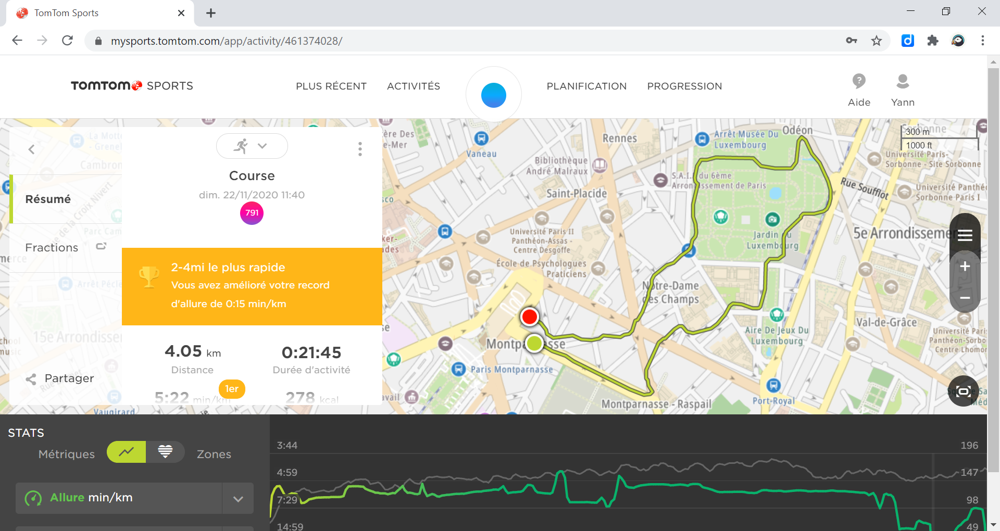

# Running


 Analyze GPX data with Python \& MATLAB


GPX (GPS eXchange Format) is an XML based file format for GPS tracks.


## Tomtom


[https://mysports.tomtom.com/](https://mysports.tomtom.com/)





Download as **gpx**


Export all files [https://mysports.tomtom.com/app/settings/exporters/](https://mysports.tomtom.com/app/settings/exporters/)


```matlab:Code
gpx_files = dir("tomtom\*gpx")
```

|Fields|name|folder|date|bytes|isdir|datenum|
|:--:|:--:|:--:|:--:|:--:|:--:|:--:|
|1|'running_2017-06-18_...|'C:\\Users\\ydebray\...|'11-nov.-2020 17:40:...|1622984|0|7.3811e+05|
|2|'running_2017-06-25_...|'C:\\Users\\ydebray\...|'11-nov.-2020 17:40:...|1644514|0|7.3811e+05|
|3|'running_2017-07-02_...|'C:\\Users\\ydebray\...|'11-nov.-2020 17:40:...|1005843|0|7.3811e+05|
|4|'running_2017-07-05_...|'C:\\Users\\ydebray\...|'11-nov.-2020 17:40:...|731879|0|7.3811e+05|
|5|'running_2017-07-23_...|'C:\\Users\\ydebray\...|'11-nov.-2020 17:40:...|1175792|0|7.3811e+05|
|6|'running_2018-02-10_...|'C:\\Users\\ydebray\...|'11-nov.-2020 17:40:...|1285381|0|7.3811e+05|
|7|'running_2018-02-17_...|'C:\\Users\\ydebray\...|'11-nov.-2020 17:40:...|701055|0|7.3811e+05|
|8|'running_2018-04-01_...|'C:\\Users\\ydebray\...|'11-nov.-2020 17:40:...|1175610|0|7.3811e+05|
|9|'running_2018-04-08_...|'C:\\Users\\ydebray\...|'11-nov.-2020 17:40:...|217324|0|7.3811e+05|
|10|'running_2018-04-08_...|'C:\\Users\\ydebray\...|'11-nov.-2020 17:40:...|271587|0|7.3811e+05|
|11|'running_2018-04-21_...|'C:\\Users\\ydebray\...|'11-nov.-2020 17:40:...|259455|0|7.3811e+05|
|12|'running_2018-04-24_...|'C:\\Users\\ydebray\...|'11-nov.-2020 17:40:...|192915|0|7.3811e+05|
|13|'running_2018-04-26_...|'C:\\Users\\ydebray\...|'11-nov.-2020 17:40:...|189438|0|7.3811e+05|
|14|'running_2018-06-09_...|'C:\\Users\\ydebray\...|'11-nov.-2020 17:40:...|541515|0|7.3811e+05|
|15|'running_2018-07-03_...|'C:\\Users\\ydebray\...|'11-nov.-2020 17:40:...|955566|0|7.3811e+05|
|16|'running_2018-07-08_...|'C:\\Users\\ydebray\...|'11-nov.-2020 17:40:...|818887|0|7.3811e+05|
|17|'running_2018-07-08_...|'C:\\Users\\ydebray\...|'11-nov.-2020 17:40:...|688|0|7.3811e+05|
|18|'running_2018-08-14_...|'C:\\Users\\ydebray\...|'11-nov.-2020 17:40:...|237631|0|7.3811e+05|
|19|'running_2018-09-13_...|'C:\\Users\\ydebray\...|'11-nov.-2020 17:40:...|1278727|0|7.3811e+05|
|20|'running_2018-09-15_...|'C:\\Users\\ydebray\...|'11-nov.-2020 17:40:...|1064212|0|7.3811e+05|
|21|'running_2018-09-23_...|'C:\\Users\\ydebray\...|'11-nov.-2020 17:40:...|1004260|0|7.3811e+05|
|22|'running_2018-09-30_...|'C:\\Users\\ydebray\...|'11-nov.-2020 17:40:...|835722|0|7.3811e+05|
|23|'running_2020-04-07_...|'C:\\Users\\ydebray\...|'11-nov.-2020 17:40:...|430239|0|7.3811e+05|
|24|'running_2020-04-13_...|'C:\\Users\\ydebray\...|'11-nov.-2020 17:40:...|420887|0|7.3811e+05|
|25|'running_2020-11-03_...|'C:\\Users\\ydebray\...|'11-nov.-2020 17:40:...|321464|0|7.3811e+05|
|26|'running_2020-11-06_...|'C:\\Users\\ydebray\...|'11-nov.-2020 17:40:...|411351|0|7.3811e+05|
|27|'running_2020-11-08_...|'C:\\Users\\ydebray\...|'11-nov.-2020 17:40:...|494543|0|7.3811e+05|
|28|'running_2020-11-11_...|'C:\\Users\\ydebray\...|'11-nov.-2020 17:40:...|392973|0|7.3811e+05|


Open the last file of the list


```matlab:Code
gpx_file = gpx_files(end)
```


```text:Output
gpx_file = 
       name: 'running_2020-11-11_13-12-41.gpx'
     folder: 'C:\Users\ydebray\Downloads\running\tomtom'
       date: '11-nov.-2020 17:40:51'
      bytes: 392973
      isdir: 0
    datenum: 7.3811e+05

```

## gpxread


Use [gpxread](https://mathworks.com/help/map/ref/gpxread.html) from the Mapping toolbox


```matlab:Code
P = gpxread(string(gpx_file.folder)+'\'+string(gpx_file.name))
```


```text:Output
P = 
 1070x1 geopoint vector with properties:

 Collection properties:
     Geometry: 'point'
     Metadata: [1x1 struct]
 Feature properties:
     Latitude: [1x1070 double]
    Longitude: [1x1070 double]
    Elevation: [1x1070 double]
         Time: {1x1070 cell}

```


```matlab:Code
P.Metadata
```


```text:Output
ans = 
    FeatureType: 'track'
           Name: 'Running'

```


```matlab:Code
geoplot(P.Latitude,P.Longitude)
```


```matlab:Code
P.Time(1)
```


```text:Output
ans = 
    {'2020-11-11T12:12:41.000Z'}

```


```matlab:Code
datetime(P.Time(1),'InputFormat','yyyy-MM-dd''T''HH:mm:ss.SSSZ','TimeZone',"Europe/Paris")
```


```text:Output
ans = 
   11-Nov-2020 13:12:41

```


```matlab:Code
time = datetime(P.Time,'InputFormat','yyyy-MM-dd''T''HH:mm:ss.SSSZ','TimeZone',"Europe/Paris")
```


```text:Output
time = 1x1070 datetime    
11-Nov-2020 13:12:41    11-Nov-2020 13:12:42    11-Nov-2020 13:12:43    11-Nov-2020 13:12:44    11-Nov-2020 13:12:45    11-Nov-2020 13:12:46    11-Nov-2020 13:12:47    11-Nov-2020 13:12:48    11-Nov-2020 13:12:49    11-Nov-2020 13:12:50    11-Nov-2020 13:12:51    11-Nov-2020 13:12:52    11-Nov-2020 13:12:53    11-Nov-2020 13:12:54    11-Nov-2020 13:12:55    11-Nov-2020 13:12:56    11-Nov-2020 13:12:57    11-Nov-2020 13:12:58    11-Nov-2020 13:12:59    11-Nov-2020 13:13:00    11-Nov-2020 13:13:01    11-Nov-2020 13:13:02    11-Nov-2020 13:13:03    11-Nov-2020 13:13:04    11-Nov-2020 13:13:05    11-Nov-2020 13:13:06    11-Nov-2020 13:13:07    11-Nov-2020 13:13:08    11-Nov-2020 13:13:09    11-Nov-2020 13:13:10    

```


```matlab:Code
T = table(time',P.Latitude',P.Longitude','VariableNames',{'time','lat','lon'})
```

| |time|lat|lon|
|:--:|:--:|:--:|:--:|
|1|11-Nov-2020 13:12:41|48.8413|2.3237|
|2|11-Nov-2020 13:12:42|48.8413|2.3237|
|3|11-Nov-2020 13:12:43|48.8413|2.3237|
|4|11-Nov-2020 13:12:44|48.8413|2.3237|
|5|11-Nov-2020 13:12:45|48.8413|2.3237|
|6|11-Nov-2020 13:12:46|48.8413|2.3237|
|7|11-Nov-2020 13:12:47|48.8413|2.3237|
|8|11-Nov-2020 13:12:48|48.8413|2.3237|
|9|11-Nov-2020 13:12:49|48.8413|2.3237|
|10|11-Nov-2020 13:12:50|48.8413|2.3237|
|11|11-Nov-2020 13:12:51|48.8413|2.3238|
|12|11-Nov-2020 13:12:52|48.8413|2.3238|
|13|11-Nov-2020 13:12:53|48.8412|2.3238|
|14|11-Nov-2020 13:12:54|48.8412|2.3238|
|15|11-Nov-2020 13:12:55|48.8412|2.3239|
|16|11-Nov-2020 13:12:56|48.8412|2.3239|
|17|11-Nov-2020 13:12:57|48.8412|2.3239|
|18|11-Nov-2020 13:12:58|48.8412|2.3240|
|19|11-Nov-2020 13:12:59|48.8412|2.3240|
|20|11-Nov-2020 13:13:00|48.8412|2.3240|
|21|11-Nov-2020 13:13:01|48.8411|2.3240|
|22|11-Nov-2020 13:13:02|48.8411|2.3241|
|23|11-Nov-2020 13:13:03|48.8411|2.3241|
|24|11-Nov-2020 13:13:04|48.8411|2.3242|
|25|11-Nov-2020 13:13:05|48.8411|2.3243|
|26|11-Nov-2020 13:13:06|48.8411|2.3243|
|27|11-Nov-2020 13:13:07|48.8411|2.3246|
|28|11-Nov-2020 13:13:08|48.8412|2.3247|
|29|11-Nov-2020 13:13:09|48.8412|2.3248|
|30|11-Nov-2020 13:13:10|48.8412|2.3248|
|31|11-Nov-2020 13:13:11|48.8412|2.3248|
|32|11-Nov-2020 13:13:12|48.8412|2.3249|
|33|11-Nov-2020 13:13:13|48.8412|2.3249|
|34|11-Nov-2020 13:13:14|48.8411|2.3249|
|35|11-Nov-2020 13:13:15|48.8411|2.3250|
|36|11-Nov-2020 13:13:16|48.8411|2.3250|
|37|11-Nov-2020 13:13:17|48.8411|2.3250|
|38|11-Nov-2020 13:13:18|48.8411|2.3250|
|39|11-Nov-2020 13:13:19|48.8411|2.3251|
|40|11-Nov-2020 13:13:20|48.8411|2.3251|
|41|11-Nov-2020 13:13:21|48.8410|2.3251|
|42|11-Nov-2020 13:13:22|48.8410|2.3251|
|43|11-Nov-2020 13:13:23|48.8410|2.3251|
|44|11-Nov-2020 13:13:24|48.8410|2.3251|
|45|11-Nov-2020 13:13:25|48.8410|2.3252|
|46|11-Nov-2020 13:13:26|48.8410|2.3252|
|47|11-Nov-2020 13:13:27|48.8410|2.3252|
|48|11-Nov-2020 13:13:28|48.8410|2.3252|
|49|11-Nov-2020 13:13:29|48.8410|2.3253|
|50|11-Nov-2020 13:13:30|48.8409|2.3253|
|51|11-Nov-2020 13:13:31|48.8409|2.3254|
|52|11-Nov-2020 13:13:32|48.8409|2.3254|
|53|11-Nov-2020 13:13:33|48.8409|2.3254|
|54|11-Nov-2020 13:13:34|48.8409|2.3255|
|55|11-Nov-2020 13:13:35|48.8409|2.3255|
|56|11-Nov-2020 13:13:36|48.8408|2.3256|
|57|11-Nov-2020 13:13:37|48.8408|2.3256|
|58|11-Nov-2020 13:13:38|48.8408|2.3257|
|59|11-Nov-2020 13:13:39|48.8408|2.3257|
|60|11-Nov-2020 13:13:40|48.8407|2.3257|
|61|11-Nov-2020 13:13:41|48.8407|2.3258|
|62|11-Nov-2020 13:13:42|48.8407|2.3258|
|63|11-Nov-2020 13:13:43|48.8407|2.3259|
|64|11-Nov-2020 13:13:44|48.8406|2.3259|
|65|11-Nov-2020 13:13:45|48.8406|2.3259|
|66|11-Nov-2020 13:13:46|48.8406|2.3260|
|67|11-Nov-2020 13:13:47|48.8406|2.3260|
|68|11-Nov-2020 13:13:48|48.8406|2.3261|
|69|11-Nov-2020 13:13:49|48.8406|2.3261|
|70|11-Nov-2020 13:13:50|48.8405|2.3261|
|71|11-Nov-2020 13:13:51|48.8405|2.3262|
|72|11-Nov-2020 13:13:52|48.8405|2.3262|
|73|11-Nov-2020 13:13:53|48.8405|2.3263|
|74|11-Nov-2020 13:13:54|48.8405|2.3263|
|75|11-Nov-2020 13:13:55|48.8405|2.3263|
|76|11-Nov-2020 13:13:56|48.8405|2.3264|
|77|11-Nov-2020 13:13:57|48.8405|2.3264|
|78|11-Nov-2020 13:13:58|48.8404|2.3265|
|79|11-Nov-2020 13:13:59|48.8404|2.3265|
|80|11-Nov-2020 13:14:00|48.8404|2.3266|
|81|11-Nov-2020 13:14:01|48.8404|2.3266|
|82|11-Nov-2020 13:14:02|48.8404|2.3266|
|83|11-Nov-2020 13:14:03|48.8404|2.3267|
|84|11-Nov-2020 13:14:04|48.8404|2.3267|
|85|11-Nov-2020 13:14:05|48.8404|2.3268|
|86|11-Nov-2020 13:14:06|48.8404|2.3268|
|87|11-Nov-2020 13:14:07|48.8403|2.3269|
|88|11-Nov-2020 13:14:08|48.8403|2.3269|
|89|11-Nov-2020 13:14:09|48.8403|2.3270|
|90|11-Nov-2020 13:14:10|48.8403|2.3270|
|91|11-Nov-2020 13:14:11|48.8403|2.3271|
|92|11-Nov-2020 13:14:12|48.8403|2.3271|
|93|11-Nov-2020 13:14:13|48.8403|2.3272|
|94|11-Nov-2020 13:14:14|48.8403|2.3272|
|95|11-Nov-2020 13:14:15|48.8402|2.3272|
|96|11-Nov-2020 13:14:16|48.8402|2.3273|
|97|11-Nov-2020 13:14:17|48.8402|2.3273|
|98|11-Nov-2020 13:14:18|48.8402|2.3274|
|99|11-Nov-2020 13:14:19|48.8402|2.3274|
|100|11-Nov-2020 13:14:20|48.8402|2.3275|


```matlab:Code
TT = timetable(time',P.Latitude',P.Longitude','VariableNames',{'lat','lon'})
```

| |Time|lat|lon|
|:--:|:--:|:--:|:--:|
|1|11-Nov-2020 13:12:41|48.8413|2.3237|
|2|11-Nov-2020 13:12:42|48.8413|2.3237|
|3|11-Nov-2020 13:12:43|48.8413|2.3237|
|4|11-Nov-2020 13:12:44|48.8413|2.3237|
|5|11-Nov-2020 13:12:45|48.8413|2.3237|
|6|11-Nov-2020 13:12:46|48.8413|2.3237|
|7|11-Nov-2020 13:12:47|48.8413|2.3237|
|8|11-Nov-2020 13:12:48|48.8413|2.3237|
|9|11-Nov-2020 13:12:49|48.8413|2.3237|
|10|11-Nov-2020 13:12:50|48.8413|2.3237|
|11|11-Nov-2020 13:12:51|48.8413|2.3238|
|12|11-Nov-2020 13:12:52|48.8413|2.3238|
|13|11-Nov-2020 13:12:53|48.8412|2.3238|
|14|11-Nov-2020 13:12:54|48.8412|2.3238|
|15|11-Nov-2020 13:12:55|48.8412|2.3239|
|16|11-Nov-2020 13:12:56|48.8412|2.3239|
|17|11-Nov-2020 13:12:57|48.8412|2.3239|
|18|11-Nov-2020 13:12:58|48.8412|2.3240|
|19|11-Nov-2020 13:12:59|48.8412|2.3240|
|20|11-Nov-2020 13:13:00|48.8412|2.3240|
|21|11-Nov-2020 13:13:01|48.8411|2.3240|
|22|11-Nov-2020 13:13:02|48.8411|2.3241|
|23|11-Nov-2020 13:13:03|48.8411|2.3241|
|24|11-Nov-2020 13:13:04|48.8411|2.3242|
|25|11-Nov-2020 13:13:05|48.8411|2.3243|
|26|11-Nov-2020 13:13:06|48.8411|2.3243|
|27|11-Nov-2020 13:13:07|48.8411|2.3246|
|28|11-Nov-2020 13:13:08|48.8412|2.3247|
|29|11-Nov-2020 13:13:09|48.8412|2.3248|
|30|11-Nov-2020 13:13:10|48.8412|2.3248|
|31|11-Nov-2020 13:13:11|48.8412|2.3248|
|32|11-Nov-2020 13:13:12|48.8412|2.3249|
|33|11-Nov-2020 13:13:13|48.8412|2.3249|
|34|11-Nov-2020 13:13:14|48.8411|2.3249|
|35|11-Nov-2020 13:13:15|48.8411|2.3250|
|36|11-Nov-2020 13:13:16|48.8411|2.3250|
|37|11-Nov-2020 13:13:17|48.8411|2.3250|
|38|11-Nov-2020 13:13:18|48.8411|2.3250|
|39|11-Nov-2020 13:13:19|48.8411|2.3251|
|40|11-Nov-2020 13:13:20|48.8411|2.3251|
|41|11-Nov-2020 13:13:21|48.8410|2.3251|
|42|11-Nov-2020 13:13:22|48.8410|2.3251|
|43|11-Nov-2020 13:13:23|48.8410|2.3251|
|44|11-Nov-2020 13:13:24|48.8410|2.3251|
|45|11-Nov-2020 13:13:25|48.8410|2.3252|
|46|11-Nov-2020 13:13:26|48.8410|2.3252|
|47|11-Nov-2020 13:13:27|48.8410|2.3252|
|48|11-Nov-2020 13:13:28|48.8410|2.3252|
|49|11-Nov-2020 13:13:29|48.8410|2.3253|
|50|11-Nov-2020 13:13:30|48.8409|2.3253|
|51|11-Nov-2020 13:13:31|48.8409|2.3254|
|52|11-Nov-2020 13:13:32|48.8409|2.3254|
|53|11-Nov-2020 13:13:33|48.8409|2.3254|
|54|11-Nov-2020 13:13:34|48.8409|2.3255|
|55|11-Nov-2020 13:13:35|48.8409|2.3255|
|56|11-Nov-2020 13:13:36|48.8408|2.3256|
|57|11-Nov-2020 13:13:37|48.8408|2.3256|
|58|11-Nov-2020 13:13:38|48.8408|2.3257|
|59|11-Nov-2020 13:13:39|48.8408|2.3257|
|60|11-Nov-2020 13:13:40|48.8407|2.3257|
|61|11-Nov-2020 13:13:41|48.8407|2.3258|
|62|11-Nov-2020 13:13:42|48.8407|2.3258|
|63|11-Nov-2020 13:13:43|48.8407|2.3259|
|64|11-Nov-2020 13:13:44|48.8406|2.3259|
|65|11-Nov-2020 13:13:45|48.8406|2.3259|
|66|11-Nov-2020 13:13:46|48.8406|2.3260|
|67|11-Nov-2020 13:13:47|48.8406|2.3260|
|68|11-Nov-2020 13:13:48|48.8406|2.3261|
|69|11-Nov-2020 13:13:49|48.8406|2.3261|
|70|11-Nov-2020 13:13:50|48.8405|2.3261|
|71|11-Nov-2020 13:13:51|48.8405|2.3262|
|72|11-Nov-2020 13:13:52|48.8405|2.3262|
|73|11-Nov-2020 13:13:53|48.8405|2.3263|
|74|11-Nov-2020 13:13:54|48.8405|2.3263|
|75|11-Nov-2020 13:13:55|48.8405|2.3263|
|76|11-Nov-2020 13:13:56|48.8405|2.3264|
|77|11-Nov-2020 13:13:57|48.8405|2.3264|
|78|11-Nov-2020 13:13:58|48.8404|2.3265|
|79|11-Nov-2020 13:13:59|48.8404|2.3265|
|80|11-Nov-2020 13:14:00|48.8404|2.3266|
|81|11-Nov-2020 13:14:01|48.8404|2.3266|
|82|11-Nov-2020 13:14:02|48.8404|2.3266|
|83|11-Nov-2020 13:14:03|48.8404|2.3267|
|84|11-Nov-2020 13:14:04|48.8404|2.3267|
|85|11-Nov-2020 13:14:05|48.8404|2.3268|
|86|11-Nov-2020 13:14:06|48.8404|2.3268|
|87|11-Nov-2020 13:14:07|48.8403|2.3269|
|88|11-Nov-2020 13:14:08|48.8403|2.3269|
|89|11-Nov-2020 13:14:09|48.8403|2.3270|
|90|11-Nov-2020 13:14:10|48.8403|2.3270|
|91|11-Nov-2020 13:14:11|48.8403|2.3271|
|92|11-Nov-2020 13:14:12|48.8403|2.3271|
|93|11-Nov-2020 13:14:13|48.8403|2.3272|
|94|11-Nov-2020 13:14:14|48.8403|2.3272|
|95|11-Nov-2020 13:14:15|48.8402|2.3272|
|96|11-Nov-2020 13:14:16|48.8402|2.3273|
|97|11-Nov-2020 13:14:17|48.8402|2.3273|
|98|11-Nov-2020 13:14:18|48.8402|2.3274|
|99|11-Nov-2020 13:14:19|48.8402|2.3274|
|100|11-Nov-2020 13:14:20|48.8402|2.3275|

## gpxpy


Install [gpxpy](https://pypi.org/project/gpxpy/) GPX file parser from PyPI: 


```matlab:Code
!pip install gpxpy 
```


```text:Output
Collecting gpxpy 
  Using cached https://files.pythonhosted.org/packages/dd/23/a1c04fb3ea8d57d4b46cf2956c99a62dfbe009bbe091babeef90cc3d0ef6/gpxpy-1.4.2.tar.gz 
Building wheels for collected packages: gpxpy 
  Building wheel for gpxpy (setup.py): started 
  Building wheel for gpxpy (setup.py): finished with status 'done' 
  Stored in directory: C:\Users\ydebray\AppData\Local\pip\Cache\wheels\d9\df\ed\b52985999b3967fa0ef8de22b3dc8ad3494ce3380d5328dd0f 
Successfully built gpxpy 
Installing collected packages: gpxpy 
Successfully installed gpxpy-1.4.2 
```


```matlab:Code
cd('tomtom')
py.open(gpx_file.name)
```


```matlab:Code
gpx = py.gpxpy.parse(pyfile)
```


```text:Output
gpx = 
  Python GPX with properties:

           author_email: [1x1 py.NoneType]
            author_link: [1x1 py.NoneType]
       author_link_text: [1x1 py.NoneType]
       author_link_type: [1x1 py.NoneType]
            author_name: [1x1 py.NoneType]
                 bounds: [1x1 py.NoneType]
       copyright_author: [1x1 py.NoneType]
      copyright_license: [1x1 py.NoneType]
         copyright_year: [1x1 py.NoneType]
                creator: [1x26 py.str]
            description: [1x1 py.NoneType]
             extensions: [1x0 py.list]
               keywords: [1x1 py.NoneType]
                   link: [1x1 py.NoneType]
              link_text: [1x1 py.NoneType]
              link_type: [1x1 py.NoneType]
    metadata_extensions: [1x0 py.list]
                   name: [1x8 py.str]
                  nsmap: [1x1 py.dict]
                 routes: [1x0 py.list]
       schema_locations: [1x2 py.list]
                   time: [1x1 py.NoneType]
                 tracks: [1x1 py.list]
                version: [1x3 py.str]
              waypoints: [1x0 py.list]

    GPX(tracks=[GPXTrack(name='Running', segments=[GPXTrackSegment(points=[...])])])

```


```matlab:Code
track = gpx.tracks(1)
```


```text:Output
track = 
  Python list with no properties.

    [GPXTrack(name='Running', segments=[GPXTrackSegment(points=[...])])]

```


```matlab:Code
Seg = track(1)
```


```text:Output
Seg = 
  Python list with no properties.

    [GPXTrack(name='Running', segments=[GPXTrackSegment(points=[...])])]

```

## Python User-Defined Function

```matlab:Code
coord = py.running.parse('tomtom/'+string(gpx_file.name))
```


```text:Output
coord = 
  Python list with no properties.

    [[48.841315, 48.841316, 48.841315, 48.841313, 48.84131, 48.841305, 48.8413, 48.841293, 48.841286, 48.841278, 48.841268, 48.841258, 48.841248, 48.841236, 48.841224, 48.841211, 48.841198, 48.841183, 48.841168, 48.841152, 48.841139, 48.841127, 48.841119, 48.841113, 48.841099, 48.84109, 48.841145, 48.841174, 48.841173, 48.84117, 48.841166, 48.841161, 48.841153, 48.841143, 48.84113, 48.841115, 48.841098, 48.841081, 48.841065, 48.841053, 48.841043, 48.841037, 48.841031, 48.841024, 48.841015, 48.841005, 48.840992, 48.840978, 48.840963, 48.840948, 48.840931, 48.840915, 48.840898, 48.840881, 48.840863, 48.840843, 48.840822, 48.840798, 48.840773, 48.840745, 48.840716, 48.840686, 48.840657, 48.840632, 48.84061, 48.840593, 48.840578, 48.840564, 48.840551, 48.840538, 48.840526, 48.840514, 48.840502, 48.84049, 48.840478, 48.840467, 48.840455, 48.840444, 48.840433, 48.840421, 48.84041, 48.840398, 48.840387, 48.840375, 48.840363, 48.840351, 48.840339, 48.840327, 48.840314, 48.840303, 48.840291, 48.84028, 48.840269, 48.840259, 48.84025, 48.840242, 48.840234, 48.840227, 48.84022, 48.840213, 48.840205, 48.840197, 48.840189, 48.840181, 48.840173, 48.840166, 48.840159, 48.840155, 48.840151, 48.840151, 48.840152, 48.840157, 48.840167, 48.840185, 48.840212, 48.840252, 48.840305, 48.840375, 48.840463, 48.840561, 48.840644, 48.84074, 48.840806, 48.840914, 48.841008, 48.841134, 48.841251, 48.841309, 48.841327, 48.841338, 48.841375, 48.841462, 48.84159, 48.841739, 48.841889, 48.842026, 48.842146, 48.842251, 48.842341, 48.842418, 48.842483, 48.842536, 48.842578, 48.842611, 48.842636, 48.842653, 48.842663, 48.842668, 48.842668, 48.842665, 48.842659, 48.842651, 48.842643, 48.842634, 48.842626, 48.842618, 48.842611, 48.842605, 48.842601, 48.8426, 48.842601, 48.842605, 48.842611, 48.84262, 48.84263, 48.842642, 48.842656, 48.842671, 48.842687, 48.842705, 48.842725, 48.842745, 48.842767, 48.84279, 48.842814, 48.842838, 48.842864, 48.84289, 48.842917, 48.842945, 48.842973, 48.843002, 48.84303, 48.84306, 48.843089, 48.843118, 48.843147, 48.843177, 48.843206, 48.843235, 48.843264, 48.843294, 48.843323, 48.843353, 48.843383, 48.843412, 48.843442, 48.843472, 48.843502, 48.843533, 48.843563, 48.843593, 48.843623, 48.843654, 48.843684, 48.843714, 48.843744, 48.843773, 48.843802, 48.843831, 48.843859, 48.843886, 48.843912, 48.843939, 48.843965, 48.843992, 48.84402, 48.844049, 48.844079, 48.844111, 48.844144, 48.844178, 48.844212, 48.844246, 48.84428, 48.844314, 48.844346, 48.844377, 48.844407, 48.844434, 48.84446, 48.844483, 48.844505, 48.844525, 48.844543, 48.844559, 48.844573, 48.844585, 48.844595, 48.844603, 48.844609, 48.844613, 48.844616, 48.844617, 48.844616, 48.844613, 48.84461, 48.844606, 48.844602, 48.844599, 48.844597, 48.844597, 48.844599, 48.844604, 48.844611, 48.844622, 48.844635, 48.844652, 48.844671, 48.844692, 48.844715, 48.84474, 48.844767, 48.844794, 48.844823, 48.844851, 48.84488, 48.844909, 48.844938, 48.844965, 48.844993, 48.845019, 48.845045, 48.84507, 48.845095, 48.84512, 48.845143, 48.845167, 48.84519, 48.845214, 48.845239, 48.845267, 48.845297, 48.84533, 48.845363, 48.845395, 48.845425, 48.845454, 48.84548, 48.845503, 48.845524, 48.845542, 48.845558, 48.845573, 48.845589, 48.845604, 48.845621, 48.845638, 48.845656, 48.845673, 48.845691, 48.845708, 48.845725, 48.845741, 48.845757, 48.845772, 48.845788, 48.845803, 48.845819, 48.845835, 48.845853, 48.845871, 48.84589, 48.845911, 48.845932, 48.845953, 48.845976, 48.846, 48.846025, 48.846055, 48.846087, 48.846121, 48.846153, 48.84618, 48.846199, 48.846213, 48.846222, 48.846228, 48.846233, 48.846237, 48.84624, 48.846242, 48.846244, 48.846246, 48.846248, 48.846251, 48.846253, 48.846256, 48.846259, 48.846261, 48.846263, 48.846264, 48.846265, 48.846264, 48.846261, 48.846257, 48.846253, 48.846251, 48.846252, 48.846259, 48.846271, 48.846285, 48.846301, 48.846317, 48.846334, 48.846352, 48.846371, 48.84639, 48.84641, 48.846432, 48.846454, 48.846478, 48.846504, 48.846531, 48.846558, 48.846586, 48.846614, 48.846642, 48.846669, 48.846695, 48.846719, 48.846743, 48.846765, 48.846787, 48.846809, 48.846831, 48.846854, 48.846877, 48.846902, 48.846928, 48.846955, 48.846984, 48.847013, 48.847042, 48.847073, 48.847103, 48.847133, 48.847163, 48.847193, 48.847223, 48.847252, 48.847281, 48.84731, 48.847339, 48.847368, 48.847396, 48.847424, 48.847452, 48.847479, 48.847507, 48.847534, 48.847561, 48.847588, 48.847615, 48.847642, 48.847668, 48.847694, 48.847721, 48.847747, 48.847773, 48.847799, 48.847825, 48.847852, 48.847878, 48.847904, 48.847931, 48.847957, 48.847984, 48.848011, 48.848038, 48.848066, 48.848093, 48.84812, 48.848148, 48.848175, 48.848201, 48.848227, 48.848253, 48.848277, 48.848301, 48.848324, 48.848347, 48.84837, 48.848392, 48.848415, 48.848437, 48.848461, 48.848485, 48.84851, 48.848535, 48.848561, 48.848587, 48.848613, 48.848638, 48.848664, 48.848689, 48.848714, 48.848739, 48.848762, 48.848785, 48.848806, 48.848827, 48.848846, 48.848864, 48.84888, 48.848893, 48.848903, 48.848909, 48.848909, 48.848904, 48.848894, 48.848878, 48.848857, 48.848832, 48.848804, 48.848776, 48.848748, 48.84872, 48.848692, 48.848665, 48.848638, 48.848612, 48.848585, 48.848559, 48.848533, 48.848506, 48.848479, 48.848452, 48.848423, 48.848395, 48.848365, 48.848335, 48.848305, 48.848275, 48.848244, 48.848214, 48.848184, 48.848155, 48.848125, 48.848096, 48.848068, 48.848039, 48.848011, 48.847982, 48.847954, 48.847926, 48.847899, 48.847873, 48.84785, 48.84783, 48.847813, 48.847799, 48.847789, 48.847782, 48.847777, 48.847775, 48.847774, 48.847775, 48.847777, 48.84778, 48.847782, 48.847785, 48.847787, 48.847789, 48.84779, 48.847791, 48.847792, 48.847793, 48.847794, 48.847796, 48.847797, 48.847799, 48.847802, 48.847804, 48.847807, 48.84781, 48.847814, 48.847817, 48.847821, 48.847824, 48.847828, 48.847831, 48.847833, 48.847835, 48.847836, 48.847836, 48.847835, 48.847834, 48.847835, 48.847838, 48.847846, 48.84786, 48.847878, 48.847898, 48.84792, 48.847942, 48.847963, 48.847983, 48.848003, 48.848022, 48.84804, 48.848056, 48.848072, 48.848086, 48.848099, 48.848111, 48.848122, 48.848131, 48.848139, 48.848146, 48.848151, 48.848155, 48.848157, 48.848157, 48.848156, 48.848154, 48.848152, 48.848149, 48.848148, 48.848147, 48.848147, 48.848149, 48.848151, 48.848154, 48.848158, 48.848162, 48.848166, 48.848169, 48.848172, 48.848175, 48.848177, 48.848179, 48.84818, 48.848181, 48.848182, 48.848182, 48.848183, 48.848184, 48.848185, 48.848186, 48.848187, 48.848187, 48.848188, 48.848188, 48.848188, 48.848187, 48.848186, 48.848184, 48.848181, 48.848178, 48.848174, 48.848169, 48.848163, 48.848156, 48.848148, 48.84814, 48.848132, 48.848124, 48.848117, 48.848111, 48.848105, 48.848101, 48.848099, 48.848098, 48.848099, 48.8481, 48.848101, 48.848102, 48.848103, 48.848104, 48.848103, 48.848101, 48.848098, 48.848092, 48.848086, 48.848077, 48.848065, 48.848052, 48.848036, 48.848017, 48.847996, 48.847974, 48.847952, 48.847929, 48.847906, 48.847883, 48.847859, 48.847833, 48.847806, 48.847778, 48.84775, 48.84772, 48.84769, 48.847659, 48.847629, 48.847598, 48.847567, 48.847536, 48.847506, 48.847476, 48.847447, 48.847419, 48.847392, 48.847366, 48.847341, 48.847317, 48.847293, 48.84727, 48.847246, 48.84722, 48.84719, 48.847158, 48.847126, 48.847095, 48.847063, 48.847032, 48.847002, 48.846972, 48.846942, 48.846913, 48.846884, 48.846855, 48.846826, 48.846797, 48.846767, 48.846737, 48.846705, 48.846673, 48.846639, 48.846604, 48.846568, 48.846533, 48.8465, 48.846469, 48.84644, 48.846412, 48.846383, 48.846353, 48.846322, 48.846289, 48.846256, 48.846223, 48.84619, 48.846157, 48.846125, 48.846094, 48.846064, 48.846035, 48.846007, 48.84598, 48.845952, 48.845925, 48.845897, 48.845869, 48.845839, 48.845809, 48.845778, 48.845746, 48.845714, 48.845682, 48.845649, 48.845615, 48.845582, 48.845549, 48.845516, 48.845483, 48.845451, 48.845419, 48.845387, 48.845356, 48.845324, 48.845293, 48.845262, 48.845234, 48.845207, 48.845184, 48.845163, 48.845142, 48.84512, 48.845097, 48.845071, 48.845045, 48.845018, 48.844991, 48.844965, 48.844941, 48.844918, 48.844899, 48.844882, 48.844867, 48.844855, 48.844844, 48.844834, 48.844826, 48.844819, 48.844812, 48.844806, 48.8448, 48.844794, 48.844787, 48.84478, 48.844771, 48.84476, 48.844748, 48.844734, 48.844718, 48.844701, 48.844682, 48.844663, 48.844643, 48.844623, 48.844603, 48.844584, 48.844566, 48.844548, 48.844531, 48.844515, 48.8445, 48.844485, 48.844471, 48.844458, 48.844445, 48.844433, 48.844421, 48.84441, 48.844399, 48.844387, 48.844376, 48.844365, 48.844353, 48.844341, 48.844328, 48.844314, 48.8443, 48.844285, 48.844268, 48.844251, 48.844232, 48.844212, 48.84419, 48.844167, 48.844143, 48.84412, 48.844099, 48.844081, 48.844069, 48.844061, 48.844054, 48.844044, 48.844023, 48.843993, 48.843957, 48.843916, 48.843874, 48.843831, 48.84379, 48.843751, 48.843716, 48.843685, 48.843658, 48.843632, 48.843607, 48.843581, 48.843554, 48.843526, 48.843498, 48.843469, 48.84344, 48.843411, 48.843382, 48.843353, 48.843326, 48.843298, 48.843271, 48.843245, 48.843218, 48.843193, 48.843167, 48.843142, 48.843118, 48.843093, 48.843069, 48.843046, 48.843022, 48.842999, 48.842976, 48.842954, 48.842931, 48.842909, 48.842887, 48.842866, 48.842844, 48.842823, 48.842801, 48.84278, 48.842759, 48.842737, 48.842716, 48.842695, 48.842673, 48.842652, 48.84263, 48.842609, 48.842587, 48.842565, 48.842543, 48.842523, 48.842503, 48.842485, 48.842469, 48.842456, 48.842445, 48.842437, 48.842429, 48.842421, 48.842409, 48.842393, 48.842373, 48.842351, 48.842329, 48.842306, 48.842285, 48.842264, 48.842244, 48.842225, 48.842208, 48.842192, 48.842175, 48.842159, 48.842141, 48.842122, 48.842103, 48.842084, 48.842065, 48.842047, 48.84203, 48.842014, 48.842, 48.841988, 48.841978, 48.84197, 48.841965, 48.841963, 48.841962, 48.841963, 48.841964, 48.841964, 48.841965, 48.841965, 48.841965, 48.841964, 48.841964, 48.841964, 48.841964, 48.841963, 48.841964, 48.841964, 48.841965, 48.841965, 48.841967, 48.841968, 48.84197, 48.841972, 48.841975, 48.841978, 48.841981, 48.841985, 48.84199, 48.841995, 48.842, 48.842006, 48.842013, 48.84202, 48.842026, 48.842032, 48.842037, 48.84204, 48.84204, 48.842039, 48.842034, 48.842027, 48.842015, 48.842001, 48.841982, 48.84196, 48.841935, 48.841907, 48.841877, 48.841849, 48.841826, 48.84181, 48.841801, 48.841796, 48.841795, 48.841798, 48.841806, 48.84182, 48.841836, 48.841852, 48.841865, 48.841873, 48.841877, 48.841877, 48.841876, 48.841875, 48.841873, 48.841871, 48.841869, 48.841867, 48.841864, 48.841861, 48.841858, 48.841854, 48.841851, 48.841847, 48.841842, 48.841838, 48.841833, 48.841828, 48.841822, 48.841817, 48.841811, 48.841804, 48.841798, 48.841791, 48.841785, 48.841779, 48.841772, 48.841767, 48.841761, 48.841756, 48.841752, 48.841751, 48.841754, 48.841757, 48.841743, 48.841699, 48.841644, 48.841603, 48.841577, 48.841563, 48.841556, 48.841552, 48.841551, 48.841552, 48.841552, 48.841552, 48.841551, 48.841549, 48.841548, 48.841548, 48.841548, 48.84155, 48.841553, 48.841558, 48.841565, 48.841574, 48.841585, 48.841597, 48.84161, 48.841625, 48.841641, 48.841657, 48.841675, 48.841694, 48.841713, 48.841733, 48.841754, 48.841775, 48.841796, 48.841817, 48.841838, 48.841859, 48.84188, 48.8419, 48.84192, 48.841939, 48.841957, 48.841974, 48.84199, 48.842005, 48.842022, 48.84204, 48.84206, 48.842082, 48.842106, 48.842131, 48.842157, 48.842182, 48.842206, 48.842228, 48.842245, 48.842257, 48.842266, 48.842276, 48.842288, 48.842306, 48.842328, 48.842353, 48.842379, 48.842405, 48.84243, 48.842455, 48.842479, 48.842502, 48.842525, 48.842547, 48.842568, 48.842588, 48.842607, 48.842626, 48.842643, 48.84266, 48.842676, 48.84269, 48.842704, 48.842716, 48.842727, 48.842737, 48.842746], [2.323681, 2.323686, 2.32369, 2.323693, 2.323697, 2.323702, 2.323707, 2.323715, 2.323725, 2.323737, 2.323753, 2.323773, 2.323797, 2.323826, 2.32386, 2.323897, 2.323932, 2.323964, 2.32399, 2.324015, 2.324045, 2.324088, 2.324148, 2.324221, 2.324251, 2.324282, 2.324577, 2.324749, 2.32479, 2.324816, 2.324847, 2.324881, 2.324915, 2.324947, 2.324977, 2.325003, 2.325025, 2.325045, 2.325062, 2.325077, 2.325092, 2.325107, 2.325123, 2.325141, 2.325163, 2.325188, 2.325216, 2.325247, 2.32528, 2.325316, 2.325355, 2.325396, 2.325439, 2.325484, 2.325529, 2.325575, 2.32562, 2.325664, 2.325707, 2.325749, 2.325789, 2.325828, 2.325867, 2.325906, 2.325945, 2.325984, 2.326023, 2.326063, 2.326102, 2.326142, 2.326181, 2.326221, 2.326261, 2.326302, 2.326342, 2.326383, 2.326425, 2.326467, 2.32651, 2.326553, 2.326597, 2.326642, 2.326688, 2.326735, 2.326782, 2.326831, 2.32688, 2.326929, 2.326978, 2.327026, 2.327073, 2.327118, 2.327162, 2.327206, 2.327249, 2.327292, 2.327334, 2.327375, 2.327415, 2.327453, 2.327491, 2.327527, 2.327561, 2.327595, 2.327631, 2.327669, 2.327712, 2.32776, 2.327816, 2.327881, 2.327956, 2.328043, 2.328149, 2.328279, 2.328441, 2.328641, 2.328885, 2.329179, 2.329532, 2.329912, 2.330238, 2.33062, 2.330898, 2.331171, 2.3314, 2.331761, 2.332033, 2.332146, 2.332164, 2.332165, 2.332228, 2.33241, 2.332689, 2.33302, 2.333359, 2.333669, 2.333946, 2.334191, 2.334407, 2.334596, 2.334759, 2.3349, 2.33502, 2.335121, 2.335207, 2.335278, 2.335337, 2.335387, 2.335429, 2.335466, 2.3355, 2.335533, 2.335567, 2.335602, 2.335638, 2.335674, 2.335711, 2.335749, 2.335787, 2.335825, 2.335863, 2.335901, 2.335939, 2.335976, 2.336013, 2.33605, 2.336085, 2.336119, 2.336151, 2.336179, 2.336204, 2.336226, 2.336246, 2.336264, 2.336279, 2.336293, 2.336305, 2.336316, 2.336326, 2.336336, 2.336344, 2.336353, 2.336362, 2.336371, 2.33638, 2.336391, 2.336402, 2.336414, 2.336427, 2.336439, 2.336451, 2.336462, 2.336471, 2.33648, 2.336486, 2.33649, 2.336493, 2.336495, 2.336496, 2.336497, 2.336497, 2.336497, 2.336497, 2.336498, 2.336498, 2.336499, 2.336501, 2.336502, 2.336504, 2.336506, 2.336508, 2.336511, 2.336514, 2.336516, 2.336519, 2.336522, 2.336524, 2.336525, 2.336527, 2.336527, 2.336527, 2.336528, 2.336529, 2.336531, 2.336534, 2.33654, 2.336548, 2.336558, 2.336572, 2.336588, 2.336608, 2.336631, 2.336656, 2.336685, 2.336715, 2.336749, 2.336784, 2.336822, 2.336861, 2.336902, 2.336943, 2.336985, 2.337027, 2.337068, 2.337109, 2.337148, 2.337187, 2.337224, 2.337261, 2.337297, 2.337332, 2.337368, 2.337403, 2.337437, 2.337471, 2.337501, 2.337527, 2.337549, 2.337565, 2.337578, 2.337586, 2.337592, 2.337596, 2.337597, 2.337597, 2.337597, 2.337596, 2.337595, 2.337595, 2.337597, 2.3376, 2.337603, 2.337607, 2.337612, 2.337618, 2.337623, 2.337628, 2.337633, 2.337638, 2.337642, 2.337647, 2.337654, 2.337662, 2.337672, 2.337687, 2.337706, 2.337731, 2.33776, 2.337792, 2.337826, 2.337861, 2.337895, 2.337929, 2.337963, 2.337997, 2.338031, 2.338065, 2.338098, 2.338132, 2.338164, 2.338197, 2.338228, 2.338258, 2.338288, 2.338316, 2.338343, 2.33837, 2.338396, 2.338421, 2.338446, 2.338471, 2.338495, 2.338519, 2.338541, 2.338561, 2.338577, 2.338588, 2.338597, 2.338607, 2.338621, 2.338641, 2.338667, 2.338699, 2.338733, 2.338771, 2.33881, 2.338851, 2.338892, 2.338933, 2.338973, 2.339014, 2.339054, 2.339095, 2.339136, 2.339178, 2.33922, 2.339263, 2.339307, 2.339351, 2.339395, 2.339439, 2.339482, 2.339524, 2.339566, 2.339608, 2.339649, 2.339691, 2.339731, 2.33977, 2.339807, 2.339841, 2.339874, 2.339904, 2.339932, 2.339959, 2.339983, 2.340006, 2.340027, 2.340047, 2.340066, 2.340083, 2.3401, 2.340115, 2.34013, 2.340144, 2.340156, 2.340167, 2.340177, 2.340185, 2.340192, 2.340197, 2.3402, 2.340202, 2.340203, 2.340203, 2.340202, 2.3402, 2.340199, 2.340197, 2.340195, 2.340193, 2.34019, 2.340187, 2.340182, 2.340177, 2.34017, 2.340161, 2.34015, 2.340138, 2.340124, 2.340108, 2.340091, 2.340073, 2.340054, 2.340034, 2.340014, 2.339993, 2.339972, 2.33995, 2.339929, 2.339907, 2.339886, 2.339865, 2.339845, 2.339825, 2.339805, 2.339786, 2.339767, 2.339747, 2.339728, 2.339709, 2.339689, 2.33967, 2.339649, 2.339629, 2.339607, 2.339585, 2.339563, 2.339539, 2.339515, 2.339489, 2.339463, 2.339436, 2.33941, 2.339384, 2.339358, 2.339333, 2.33931, 2.339288, 2.339269, 2.33925, 2.339233, 2.339217, 2.3392, 2.339184, 2.339167, 2.339149, 2.339129, 2.339108, 2.339086, 2.339063, 2.33904, 2.339016, 2.338992, 2.338968, 2.338945, 2.338921, 2.338899, 2.338875, 2.338852, 2.338827, 2.338802, 2.338775, 2.338746, 2.338715, 2.338682, 2.338645, 2.338606, 2.338563, 2.338521, 2.338484, 2.338453, 2.338434, 2.338423, 2.338419, 2.338418, 2.33842, 2.338422, 2.338424, 2.338427, 2.338429, 2.33843, 2.338431, 2.338431, 2.338431, 2.33843, 2.338429, 2.338428, 2.338426, 2.338425, 2.338422, 2.33842, 2.338417, 2.338413, 2.338409, 2.338404, 2.338398, 2.338391, 2.338383, 2.338374, 2.338364, 2.338353, 2.33834, 2.338326, 2.33831, 2.338293, 2.338273, 2.338249, 2.338222, 2.338189, 2.338151, 2.338111, 2.338068, 2.338023, 2.337978, 2.337932, 2.337885, 2.337838, 2.337791, 2.337744, 2.337698, 2.337652, 2.337607, 2.337564, 2.337521, 2.337478, 2.337436, 2.337395, 2.337354, 2.337313, 2.337273, 2.337232, 2.337192, 2.337152, 2.337112, 2.337071, 2.337031, 2.336991, 2.336951, 2.336911, 2.336871, 2.336832, 2.336792, 2.336752, 2.336712, 2.33667, 2.336627, 2.336583, 2.33654, 2.336497, 2.336457, 2.33642, 2.336385, 2.336352, 2.336321, 2.336291, 2.336262, 2.336232, 2.336202, 2.336171, 2.336138, 2.336103, 2.336066, 2.336026, 2.335983, 2.335939, 2.335893, 2.335847, 2.3358, 2.335754, 2.335707, 2.335659, 2.335612, 2.335563, 2.335515, 2.335468, 2.335421, 2.335376, 2.335332, 2.33529, 2.33525, 2.335213, 2.335176, 2.33514, 2.335105, 2.33507, 2.335034, 2.334997, 2.334958, 2.334918, 2.334876, 2.334832, 2.334788, 2.334743, 2.334698, 2.334653, 2.334608, 2.334564, 2.334521, 2.334478, 2.334436, 2.334395, 2.334354, 2.334313, 2.334273, 2.334232, 2.334192, 2.334152, 2.334112, 2.334072, 2.334031, 2.333991, 2.33395, 2.333908, 2.333866, 2.333824, 2.333782, 2.33374, 2.333697, 2.333655, 2.333613, 2.333572, 2.333531, 2.33349, 2.333449, 2.333407, 2.333365, 2.333322, 2.333277, 2.333231, 2.333183, 2.333134, 2.333086, 2.333039, 2.332994, 2.332952, 2.332915, 2.332882, 2.332857, 2.332838, 2.332825, 2.332817, 2.332812, 2.332809, 2.332808, 2.332807, 2.332806, 2.332804, 2.332801, 2.332797, 2.332793, 2.332789, 2.332784, 2.33278, 2.332775, 2.332771, 2.332767, 2.332763, 2.332761, 2.332759, 2.332758, 2.332759, 2.332761, 2.332764, 2.332769, 2.332777, 2.332789, 2.332806, 2.332827, 2.332846, 2.332855, 2.332858, 2.332859, 2.332859, 2.332857, 2.332855, 2.332852, 2.332847, 2.332841, 2.332834, 2.332825, 2.332815, 2.332805, 2.332793, 2.332781, 2.332769, 2.332756, 2.332743, 2.332731, 2.332719, 2.332708, 2.3327, 2.332696, 2.332695, 2.332697, 2.332701, 2.332703, 2.332704, 2.332703, 2.3327, 2.332697, 2.332694, 2.332691, 2.332689, 2.332689, 2.332692, 2.332697, 2.332705, 2.332715, 2.332726, 2.332738, 2.33275, 2.332762, 2.332773, 2.332783, 2.332791, 2.332799, 2.332805, 2.33281, 2.332814, 2.332817, 2.332819, 2.33282, 2.332821, 2.332821, 2.332823, 2.332826, 2.332832, 2.332837, 2.332841, 2.332838, 2.332829, 2.332814, 2.332795, 2.332773, 2.332751, 2.33273, 2.33271, 2.332692, 2.332678, 2.332666, 2.332656, 2.332648, 2.332641, 2.332633, 2.332625, 2.332615, 2.332604, 2.33259, 2.332574, 2.332556, 2.332536, 2.332512, 2.332486, 2.332458, 2.332426, 2.332391, 2.332354, 2.332316, 2.332276, 2.332235, 2.332194, 2.332154, 2.332115, 2.332078, 2.332042, 2.332007, 2.331974, 2.331942, 2.33191, 2.33188, 2.331849, 2.331819, 2.331789, 2.331759, 2.331729, 2.331698, 2.331667, 2.331636, 2.331604, 2.331571, 2.331537, 2.331503, 2.331468, 2.331433, 2.331397, 2.331361, 2.331324, 2.331287, 2.33125, 2.331212, 2.331174, 2.331137, 2.331099, 2.331061, 2.331023, 2.330985, 2.330948, 2.330909, 2.33087, 2.330828, 2.330783, 2.33074, 2.330701, 2.330671, 2.330652, 2.330641, 2.330634, 2.330622, 2.330599, 2.330569, 2.330535, 2.330501, 2.330472, 2.330448, 2.330429, 2.330416, 2.330408, 2.330405, 2.330405, 2.330407, 2.330408, 2.330407, 2.330404, 2.330398, 2.330391, 2.330383, 2.330373, 2.330362, 2.330351, 2.33034, 2.330328, 2.330316, 2.330304, 2.330292, 2.330279, 2.330267, 2.330254, 2.330241, 2.330228, 2.330214, 2.330201, 2.330188, 2.330174, 2.330161, 2.330147, 2.330134, 2.33012, 2.330107, 2.330093, 2.33008, 2.330066, 2.330053, 2.330039, 2.330025, 2.330011, 2.329996, 2.329982, 2.329967, 2.329952, 2.329936, 2.32992, 2.329904, 2.329888, 2.329871, 2.329853, 2.329834, 2.329813, 2.32979, 2.329765, 2.329736, 2.329705, 2.329671, 2.329637, 2.329604, 2.329575, 2.329551, 2.329533, 2.329518, 2.329506, 2.329494, 2.329483, 2.329471, 2.329456, 2.329438, 2.329416, 2.329392, 2.329368, 2.329345, 2.329326, 2.329312, 2.3293, 2.329292, 2.329286, 2.329283, 2.329281, 2.32928, 2.32928, 2.329277, 2.329269, 2.329252, 2.329222, 2.329179, 2.329125, 2.329067, 2.32901, 2.328958, 2.328911, 2.328869, 2.328831, 2.328796, 2.328763, 2.328732, 2.328701, 2.328671, 2.32864, 2.328609, 2.328579, 2.328548, 2.328518, 2.328487, 2.328457, 2.328427, 2.328396, 2.328367, 2.328337, 2.328308, 2.328279, 2.32825, 2.328221, 2.328193, 2.328166, 2.328138, 2.32811, 2.328082, 2.328053, 2.328022, 2.327991, 2.327957, 2.327922, 2.327883, 2.327842, 2.327797, 2.327749, 2.327698, 2.327646, 2.327596, 2.327549, 2.327506, 2.327467, 2.327432, 2.327398, 2.32736, 2.32732, 2.327279, 2.327242, 2.327207, 2.327176, 2.327144, 2.32711, 2.327072, 2.327031, 2.326988, 2.326945, 2.326902, 2.326861, 2.326821, 2.326781, 2.326742, 2.326704, 2.326666, 2.326629, 2.326591, 2.326554, 2.326516, 2.326479, 2.326441, 2.326403, 2.326364, 2.326325, 2.326285, 2.326244, 2.326202, 2.32616, 2.326117, 2.326075, 2.326032, 2.32599, 2.325948, 2.325906, 2.325866, 2.325827, 2.325789, 2.325754, 2.32572, 2.325673, 2.325605, 2.325533, 2.325475, 2.32543, 2.325394, 2.32536, 2.325324, 2.325287, 2.325248, 2.325208, 2.325168, 2.325127, 2.325087, 2.325047, 2.325007, 2.324967, 2.324929, 2.324891, 2.324854, 2.324818, 2.324783, 2.324749, 2.324716, 2.324683, 2.324651, 2.324619, 2.324588, 2.324557, 2.324526, 2.324496, 2.324465, 2.324434, 2.324403, 2.324373, 2.324341, 2.32431, 2.324277, 2.324245, 2.324211, 2.324176, 2.324141, 2.324103, 2.324065, 2.324025, 2.323986, 2.32395, 2.323919, 2.323894, 2.323872, 2.323848, 2.323818, 2.323779, 2.323735, 2.323692, 2.323656, 2.323629, 2.323609, 2.323587, 2.323554, 2.323517, 2.323483, 2.323454, 2.323427, 2.323402, 2.323376, 2.323351, 2.323325, 2.3233, 2.323275, 2.32325, 2.323226, 2.323202, 2.32318, 2.323158, 2.323138, 2.323118, 2.3231, 2.323084, 2.323069, 2.323056, 2.323044, 2.323035, 2.323028, 2.323023]]

```


```matlab:Code
c = cell(coord)
```

| |1|2|
|:--:|:--:|:--:|
|1|1x1070 list|1x1070 list|


```matlab:Code
c(1)
```


```text:Output
ans = 
    {1x1070 py.list}

```


```matlab:Code
coord2 = py.running.parse2('tomtom/'+string(gpx_file.name))
```


```text:Output
coord2 = 
  Python dict with no properties.

    {'lat': [48.841315, 48.841316, 48.841315, 48.841313, 48.84131, 48.841305, 48.8413, 48.841293, 48.841286, 48.841278, 48.841268, 48.841258, 48.841248, 48.841236, 48.841224, 48.841211, 48.841198, 48.841183, 48.841168, 48.841152, 48.841139, 48.841127, 48.841119, 48.841113, 48.841099, 48.84109, 48.841145, 48.841174, 48.841173, 48.84117, 48.841166, 48.841161, 48.841153, 48.841143, 48.84113, 48.841115, 48.841098, 48.841081, 48.841065, 48.841053, 48.841043, 48.841037, 48.841031, 48.841024, 48.841015, 48.841005, 48.840992, 48.840978, 48.840963, 48.840948, 48.840931, 48.840915, 48.840898, 48.840881, 48.840863, 48.840843, 48.840822, 48.840798, 48.840773, 48.840745, 48.840716, 48.840686, 48.840657, 48.840632, 48.84061, 48.840593, 48.840578, 48.840564, 48.840551, 48.840538, 48.840526, 48.840514, 48.840502, 48.84049, 48.840478, 48.840467, 48.840455, 48.840444, 48.840433, 48.840421, 48.84041, 48.840398, 48.840387, 48.840375, 48.840363, 48.840351, 48.840339, 48.840327, 48.840314, 48.840303, 48.840291, 48.84028, 48.840269, 48.840259, 48.84025, 48.840242, 48.840234, 48.840227, 48.84022, 48.840213, 48.840205, 48.840197, 48.840189, 48.840181, 48.840173, 48.840166, 48.840159, 48.840155, 48.840151, 48.840151, 48.840152, 48.840157, 48.840167, 48.840185, 48.840212, 48.840252, 48.840305, 48.840375, 48.840463, 48.840561, 48.840644, 48.84074, 48.840806, 48.840914, 48.841008, 48.841134, 48.841251, 48.841309, 48.841327, 48.841338, 48.841375, 48.841462, 48.84159, 48.841739, 48.841889, 48.842026, 48.842146, 48.842251, 48.842341, 48.842418, 48.842483, 48.842536, 48.842578, 48.842611, 48.842636, 48.842653, 48.842663, 48.842668, 48.842668, 48.842665, 48.842659, 48.842651, 48.842643, 48.842634, 48.842626, 48.842618, 48.842611, 48.842605, 48.842601, 48.8426, 48.842601, 48.842605, 48.842611, 48.84262, 48.84263, 48.842642, 48.842656, 48.842671, 48.842687, 48.842705, 48.842725, 48.842745, 48.842767, 48.84279, 48.842814, 48.842838, 48.842864, 48.84289, 48.842917, 48.842945, 48.842973, 48.843002, 48.84303, 48.84306, 48.843089, 48.843118, 48.843147, 48.843177, 48.843206, 48.843235, 48.843264, 48.843294, 48.843323, 48.843353, 48.843383, 48.843412, 48.843442, 48.843472, 48.843502, 48.843533, 48.843563, 48.843593, 48.843623, 48.843654, 48.843684, 48.843714, 48.843744, 48.843773, 48.843802, 48.843831, 48.843859, 48.843886, 48.843912, 48.843939, 48.843965, 48.843992, 48.84402, 48.844049, 48.844079, 48.844111, 48.844144, 48.844178, 48.844212, 48.844246, 48.84428, 48.844314, 48.844346, 48.844377, 48.844407, 48.844434, 48.84446, 48.844483, 48.844505, 48.844525, 48.844543, 48.844559, 48.844573, 48.844585, 48.844595, 48.844603, 48.844609, 48.844613, 48.844616, 48.844617, 48.844616, 48.844613, 48.84461, 48.844606, 48.844602, 48.844599, 48.844597, 48.844597, 48.844599, 48.844604, 48.844611, 48.844622, 48.844635, 48.844652, 48.844671, 48.844692, 48.844715, 48.84474, 48.844767, 48.844794, 48.844823, 48.844851, 48.84488, 48.844909, 48.844938, 48.844965, 48.844993, 48.845019, 48.845045, 48.84507, 48.845095, 48.84512, 48.845143, 48.845167, 48.84519, 48.845214, 48.845239, 48.845267, 48.845297, 48.84533, 48.845363, 48.845395, 48.845425, 48.845454, 48.84548, 48.845503, 48.845524, 48.845542, 48.845558, 48.845573, 48.845589, 48.845604, 48.845621, 48.845638, 48.845656, 48.845673, 48.845691, 48.845708, 48.845725, 48.845741, 48.845757, 48.845772, 48.845788, 48.845803, 48.845819, 48.845835, 48.845853, 48.845871, 48.84589, 48.845911, 48.845932, 48.845953, 48.845976, 48.846, 48.846025, 48.846055, 48.846087, 48.846121, 48.846153, 48.84618, 48.846199, 48.846213, 48.846222, 48.846228, 48.846233, 48.846237, 48.84624, 48.846242, 48.846244, 48.846246, 48.846248, 48.846251, 48.846253, 48.846256, 48.846259, 48.846261, 48.846263, 48.846264, 48.846265, 48.846264, 48.846261, 48.846257, 48.846253, 48.846251, 48.846252, 48.846259, 48.846271, 48.846285, 48.846301, 48.846317, 48.846334, 48.846352, 48.846371, 48.84639, 48.84641, 48.846432, 48.846454, 48.846478, 48.846504, 48.846531, 48.846558, 48.846586, 48.846614, 48.846642, 48.846669, 48.846695, 48.846719, 48.846743, 48.846765, 48.846787, 48.846809, 48.846831, 48.846854, 48.846877, 48.846902, 48.846928, 48.846955, 48.846984, 48.847013, 48.847042, 48.847073, 48.847103, 48.847133, 48.847163, 48.847193, 48.847223, 48.847252, 48.847281, 48.84731, 48.847339, 48.847368, 48.847396, 48.847424, 48.847452, 48.847479, 48.847507, 48.847534, 48.847561, 48.847588, 48.847615, 48.847642, 48.847668, 48.847694, 48.847721, 48.847747, 48.847773, 48.847799, 48.847825, 48.847852, 48.847878, 48.847904, 48.847931, 48.847957, 48.847984, 48.848011, 48.848038, 48.848066, 48.848093, 48.84812, 48.848148, 48.848175, 48.848201, 48.848227, 48.848253, 48.848277, 48.848301, 48.848324, 48.848347, 48.84837, 48.848392, 48.848415, 48.848437, 48.848461, 48.848485, 48.84851, 48.848535, 48.848561, 48.848587, 48.848613, 48.848638, 48.848664, 48.848689, 48.848714, 48.848739, 48.848762, 48.848785, 48.848806, 48.848827, 48.848846, 48.848864, 48.84888, 48.848893, 48.848903, 48.848909, 48.848909, 48.848904, 48.848894, 48.848878, 48.848857, 48.848832, 48.848804, 48.848776, 48.848748, 48.84872, 48.848692, 48.848665, 48.848638, 48.848612, 48.848585, 48.848559, 48.848533, 48.848506, 48.848479, 48.848452, 48.848423, 48.848395, 48.848365, 48.848335, 48.848305, 48.848275, 48.848244, 48.848214, 48.848184, 48.848155, 48.848125, 48.848096, 48.848068, 48.848039, 48.848011, 48.847982, 48.847954, 48.847926, 48.847899, 48.847873, 48.84785, 48.84783, 48.847813, 48.847799, 48.847789, 48.847782, 48.847777, 48.847775, 48.847774, 48.847775, 48.847777, 48.84778, 48.847782, 48.847785, 48.847787, 48.847789, 48.84779, 48.847791, 48.847792, 48.847793, 48.847794, 48.847796, 48.847797, 48.847799, 48.847802, 48.847804, 48.847807, 48.84781, 48.847814, 48.847817, 48.847821, 48.847824, 48.847828, 48.847831, 48.847833, 48.847835, 48.847836, 48.847836, 48.847835, 48.847834, 48.847835, 48.847838, 48.847846, 48.84786, 48.847878, 48.847898, 48.84792, 48.847942, 48.847963, 48.847983, 48.848003, 48.848022, 48.84804, 48.848056, 48.848072, 48.848086, 48.848099, 48.848111, 48.848122, 48.848131, 48.848139, 48.848146, 48.848151, 48.848155, 48.848157, 48.848157, 48.848156, 48.848154, 48.848152, 48.848149, 48.848148, 48.848147, 48.848147, 48.848149, 48.848151, 48.848154, 48.848158, 48.848162, 48.848166, 48.848169, 48.848172, 48.848175, 48.848177, 48.848179, 48.84818, 48.848181, 48.848182, 48.848182, 48.848183, 48.848184, 48.848185, 48.848186, 48.848187, 48.848187, 48.848188, 48.848188, 48.848188, 48.848187, 48.848186, 48.848184, 48.848181, 48.848178, 48.848174, 48.848169, 48.848163, 48.848156, 48.848148, 48.84814, 48.848132, 48.848124, 48.848117, 48.848111, 48.848105, 48.848101, 48.848099, 48.848098, 48.848099, 48.8481, 48.848101, 48.848102, 48.848103, 48.848104, 48.848103, 48.848101, 48.848098, 48.848092, 48.848086, 48.848077, 48.848065, 48.848052, 48.848036, 48.848017, 48.847996, 48.847974, 48.847952, 48.847929, 48.847906, 48.847883, 48.847859, 48.847833, 48.847806, 48.847778, 48.84775, 48.84772, 48.84769, 48.847659, 48.847629, 48.847598, 48.847567, 48.847536, 48.847506, 48.847476, 48.847447, 48.847419, 48.847392, 48.847366, 48.847341, 48.847317, 48.847293, 48.84727, 48.847246, 48.84722, 48.84719, 48.847158, 48.847126, 48.847095, 48.847063, 48.847032, 48.847002, 48.846972, 48.846942, 48.846913, 48.846884, 48.846855, 48.846826, 48.846797, 48.846767, 48.846737, 48.846705, 48.846673, 48.846639, 48.846604, 48.846568, 48.846533, 48.8465, 48.846469, 48.84644, 48.846412, 48.846383, 48.846353, 48.846322, 48.846289, 48.846256, 48.846223, 48.84619, 48.846157, 48.846125, 48.846094, 48.846064, 48.846035, 48.846007, 48.84598, 48.845952, 48.845925, 48.845897, 48.845869, 48.845839, 48.845809, 48.845778, 48.845746, 48.845714, 48.845682, 48.845649, 48.845615, 48.845582, 48.845549, 48.845516, 48.845483, 48.845451, 48.845419, 48.845387, 48.845356, 48.845324, 48.845293, 48.845262, 48.845234, 48.845207, 48.845184, 48.845163, 48.845142, 48.84512, 48.845097, 48.845071, 48.845045, 48.845018, 48.844991, 48.844965, 48.844941, 48.844918, 48.844899, 48.844882, 48.844867, 48.844855, 48.844844, 48.844834, 48.844826, 48.844819, 48.844812, 48.844806, 48.8448, 48.844794, 48.844787, 48.84478, 48.844771, 48.84476, 48.844748, 48.844734, 48.844718, 48.844701, 48.844682, 48.844663, 48.844643, 48.844623, 48.844603, 48.844584, 48.844566, 48.844548, 48.844531, 48.844515, 48.8445, 48.844485, 48.844471, 48.844458, 48.844445, 48.844433, 48.844421, 48.84441, 48.844399, 48.844387, 48.844376, 48.844365, 48.844353, 48.844341, 48.844328, 48.844314, 48.8443, 48.844285, 48.844268, 48.844251, 48.844232, 48.844212, 48.84419, 48.844167, 48.844143, 48.84412, 48.844099, 48.844081, 48.844069, 48.844061, 48.844054, 48.844044, 48.844023, 48.843993, 48.843957, 48.843916, 48.843874, 48.843831, 48.84379, 48.843751, 48.843716, 48.843685, 48.843658, 48.843632, 48.843607, 48.843581, 48.843554, 48.843526, 48.843498, 48.843469, 48.84344, 48.843411, 48.843382, 48.843353, 48.843326, 48.843298, 48.843271, 48.843245, 48.843218, 48.843193, 48.843167, 48.843142, 48.843118, 48.843093, 48.843069, 48.843046, 48.843022, 48.842999, 48.842976, 48.842954, 48.842931, 48.842909, 48.842887, 48.842866, 48.842844, 48.842823, 48.842801, 48.84278, 48.842759, 48.842737, 48.842716, 48.842695, 48.842673, 48.842652, 48.84263, 48.842609, 48.842587, 48.842565, 48.842543, 48.842523, 48.842503, 48.842485, 48.842469, 48.842456, 48.842445, 48.842437, 48.842429, 48.842421, 48.842409, 48.842393, 48.842373, 48.842351, 48.842329, 48.842306, 48.842285, 48.842264, 48.842244, 48.842225, 48.842208, 48.842192, 48.842175, 48.842159, 48.842141, 48.842122, 48.842103, 48.842084, 48.842065, 48.842047, 48.84203, 48.842014, 48.842, 48.841988, 48.841978, 48.84197, 48.841965, 48.841963, 48.841962, 48.841963, 48.841964, 48.841964, 48.841965, 48.841965, 48.841965, 48.841964, 48.841964, 48.841964, 48.841964, 48.841963, 48.841964, 48.841964, 48.841965, 48.841965, 48.841967, 48.841968, 48.84197, 48.841972, 48.841975, 48.841978, 48.841981, 48.841985, 48.84199, 48.841995, 48.842, 48.842006, 48.842013, 48.84202, 48.842026, 48.842032, 48.842037, 48.84204, 48.84204, 48.842039, 48.842034, 48.842027, 48.842015, 48.842001, 48.841982, 48.84196, 48.841935, 48.841907, 48.841877, 48.841849, 48.841826, 48.84181, 48.841801, 48.841796, 48.841795, 48.841798, 48.841806, 48.84182, 48.841836, 48.841852, 48.841865, 48.841873, 48.841877, 48.841877, 48.841876, 48.841875, 48.841873, 48.841871, 48.841869, 48.841867, 48.841864, 48.841861, 48.841858, 48.841854, 48.841851, 48.841847, 48.841842, 48.841838, 48.841833, 48.841828, 48.841822, 48.841817, 48.841811, 48.841804, 48.841798, 48.841791, 48.841785, 48.841779, 48.841772, 48.841767, 48.841761, 48.841756, 48.841752, 48.841751, 48.841754, 48.841757, 48.841743, 48.841699, 48.841644, 48.841603, 48.841577, 48.841563, 48.841556, 48.841552, 48.841551, 48.841552, 48.841552, 48.841552, 48.841551, 48.841549, 48.841548, 48.841548, 48.841548, 48.84155, 48.841553, 48.841558, 48.841565, 48.841574, 48.841585, 48.841597, 48.84161, 48.841625, 48.841641, 48.841657, 48.841675, 48.841694, 48.841713, 48.841733, 48.841754, 48.841775, 48.841796, 48.841817, 48.841838, 48.841859, 48.84188, 48.8419, 48.84192, 48.841939, 48.841957, 48.841974, 48.84199, 48.842005, 48.842022, 48.84204, 48.84206, 48.842082, 48.842106, 48.842131, 48.842157, 48.842182, 48.842206, 48.842228, 48.842245, 48.842257, 48.842266, 48.842276, 48.842288, 48.842306, 48.842328, 48.842353, 48.842379, 48.842405, 48.84243, 48.842455, 48.842479, 48.842502, 48.842525, 48.842547, 48.842568, 48.842588, 48.842607, 48.842626, 48.842643, 48.84266, 48.842676, 48.84269, 48.842704, 48.842716, 48.842727, 48.842737, 48.842746], 'lon': [2.323681, 2.323686, 2.32369, 2.323693, 2.323697, 2.323702, 2.323707, 2.323715, 2.323725, 2.323737, 2.323753, 2.323773, 2.323797, 2.323826, 2.32386, 2.323897, 2.323932, 2.323964, 2.32399, 2.324015, 2.324045, 2.324088, 2.324148, 2.324221, 2.324251, 2.324282, 2.324577, 2.324749, 2.32479, 2.324816, 2.324847, 2.324881, 2.324915, 2.324947, 2.324977, 2.325003, 2.325025, 2.325045, 2.325062, 2.325077, 2.325092, 2.325107, 2.325123, 2.325141, 2.325163, 2.325188, 2.325216, 2.325247, 2.32528, 2.325316, 2.325355, 2.325396, 2.325439, 2.325484, 2.325529, 2.325575, 2.32562, 2.325664, 2.325707, 2.325749, 2.325789, 2.325828, 2.325867, 2.325906, 2.325945, 2.325984, 2.326023, 2.326063, 2.326102, 2.326142, 2.326181, 2.326221, 2.326261, 2.326302, 2.326342, 2.326383, 2.326425, 2.326467, 2.32651, 2.326553, 2.326597, 2.326642, 2.326688, 2.326735, 2.326782, 2.326831, 2.32688, 2.326929, 2.326978, 2.327026, 2.327073, 2.327118, 2.327162, 2.327206, 2.327249, 2.327292, 2.327334, 2.327375, 2.327415, 2.327453, 2.327491, 2.327527, 2.327561, 2.327595, 2.327631, 2.327669, 2.327712, 2.32776, 2.327816, 2.327881, 2.327956, 2.328043, 2.328149, 2.328279, 2.328441, 2.328641, 2.328885, 2.329179, 2.329532, 2.329912, 2.330238, 2.33062, 2.330898, 2.331171, 2.3314, 2.331761, 2.332033, 2.332146, 2.332164, 2.332165, 2.332228, 2.33241, 2.332689, 2.33302, 2.333359, 2.333669, 2.333946, 2.334191, 2.334407, 2.334596, 2.334759, 2.3349, 2.33502, 2.335121, 2.335207, 2.335278, 2.335337, 2.335387, 2.335429, 2.335466, 2.3355, 2.335533, 2.335567, 2.335602, 2.335638, 2.335674, 2.335711, 2.335749, 2.335787, 2.335825, 2.335863, 2.335901, 2.335939, 2.335976, 2.336013, 2.33605, 2.336085, 2.336119, 2.336151, 2.336179, 2.336204, 2.336226, 2.336246, 2.336264, 2.336279, 2.336293, 2.336305, 2.336316, 2.336326, 2.336336, 2.336344, 2.336353, 2.336362, 2.336371, 2.33638, 2.336391, 2.336402, 2.336414, 2.336427, 2.336439, 2.336451, 2.336462, 2.336471, 2.33648, 2.336486, 2.33649, 2.336493, 2.336495, 2.336496, 2.336497, 2.336497, 2.336497, 2.336497, 2.336498, 2.336498, 2.336499, 2.336501, 2.336502, 2.336504, 2.336506, 2.336508, 2.336511, 2.336514, 2.336516, 2.336519, 2.336522, 2.336524, 2.336525, 2.336527, 2.336527, 2.336527, 2.336528, 2.336529, 2.336531, 2.336534, 2.33654, 2.336548, 2.336558, 2.336572, 2.336588, 2.336608, 2.336631, 2.336656, 2.336685, 2.336715, 2.336749, 2.336784, 2.336822, 2.336861, 2.336902, 2.336943, 2.336985, 2.337027, 2.337068, 2.337109, 2.337148, 2.337187, 2.337224, 2.337261, 2.337297, 2.337332, 2.337368, 2.337403, 2.337437, 2.337471, 2.337501, 2.337527, 2.337549, 2.337565, 2.337578, 2.337586, 2.337592, 2.337596, 2.337597, 2.337597, 2.337597, 2.337596, 2.337595, 2.337595, 2.337597, 2.3376, 2.337603, 2.337607, 2.337612, 2.337618, 2.337623, 2.337628, 2.337633, 2.337638, 2.337642, 2.337647, 2.337654, 2.337662, 2.337672, 2.337687, 2.337706, 2.337731, 2.33776, 2.337792, 2.337826, 2.337861, 2.337895, 2.337929, 2.337963, 2.337997, 2.338031, 2.338065, 2.338098, 2.338132, 2.338164, 2.338197, 2.338228, 2.338258, 2.338288, 2.338316, 2.338343, 2.33837, 2.338396, 2.338421, 2.338446, 2.338471, 2.338495, 2.338519, 2.338541, 2.338561, 2.338577, 2.338588, 2.338597, 2.338607, 2.338621, 2.338641, 2.338667, 2.338699, 2.338733, 2.338771, 2.33881, 2.338851, 2.338892, 2.338933, 2.338973, 2.339014, 2.339054, 2.339095, 2.339136, 2.339178, 2.33922, 2.339263, 2.339307, 2.339351, 2.339395, 2.339439, 2.339482, 2.339524, 2.339566, 2.339608, 2.339649, 2.339691, 2.339731, 2.33977, 2.339807, 2.339841, 2.339874, 2.339904, 2.339932, 2.339959, 2.339983, 2.340006, 2.340027, 2.340047, 2.340066, 2.340083, 2.3401, 2.340115, 2.34013, 2.340144, 2.340156, 2.340167, 2.340177, 2.340185, 2.340192, 2.340197, 2.3402, 2.340202, 2.340203, 2.340203, 2.340202, 2.3402, 2.340199, 2.340197, 2.340195, 2.340193, 2.34019, 2.340187, 2.340182, 2.340177, 2.34017, 2.340161, 2.34015, 2.340138, 2.340124, 2.340108, 2.340091, 2.340073, 2.340054, 2.340034, 2.340014, 2.339993, 2.339972, 2.33995, 2.339929, 2.339907, 2.339886, 2.339865, 2.339845, 2.339825, 2.339805, 2.339786, 2.339767, 2.339747, 2.339728, 2.339709, 2.339689, 2.33967, 2.339649, 2.339629, 2.339607, 2.339585, 2.339563, 2.339539, 2.339515, 2.339489, 2.339463, 2.339436, 2.33941, 2.339384, 2.339358, 2.339333, 2.33931, 2.339288, 2.339269, 2.33925, 2.339233, 2.339217, 2.3392, 2.339184, 2.339167, 2.339149, 2.339129, 2.339108, 2.339086, 2.339063, 2.33904, 2.339016, 2.338992, 2.338968, 2.338945, 2.338921, 2.338899, 2.338875, 2.338852, 2.338827, 2.338802, 2.338775, 2.338746, 2.338715, 2.338682, 2.338645, 2.338606, 2.338563, 2.338521, 2.338484, 2.338453, 2.338434, 2.338423, 2.338419, 2.338418, 2.33842, 2.338422, 2.338424, 2.338427, 2.338429, 2.33843, 2.338431, 2.338431, 2.338431, 2.33843, 2.338429, 2.338428, 2.338426, 2.338425, 2.338422, 2.33842, 2.338417, 2.338413, 2.338409, 2.338404, 2.338398, 2.338391, 2.338383, 2.338374, 2.338364, 2.338353, 2.33834, 2.338326, 2.33831, 2.338293, 2.338273, 2.338249, 2.338222, 2.338189, 2.338151, 2.338111, 2.338068, 2.338023, 2.337978, 2.337932, 2.337885, 2.337838, 2.337791, 2.337744, 2.337698, 2.337652, 2.337607, 2.337564, 2.337521, 2.337478, 2.337436, 2.337395, 2.337354, 2.337313, 2.337273, 2.337232, 2.337192, 2.337152, 2.337112, 2.337071, 2.337031, 2.336991, 2.336951, 2.336911, 2.336871, 2.336832, 2.336792, 2.336752, 2.336712, 2.33667, 2.336627, 2.336583, 2.33654, 2.336497, 2.336457, 2.33642, 2.336385, 2.336352, 2.336321, 2.336291, 2.336262, 2.336232, 2.336202, 2.336171, 2.336138, 2.336103, 2.336066, 2.336026, 2.335983, 2.335939, 2.335893, 2.335847, 2.3358, 2.335754, 2.335707, 2.335659, 2.335612, 2.335563, 2.335515, 2.335468, 2.335421, 2.335376, 2.335332, 2.33529, 2.33525, 2.335213, 2.335176, 2.33514, 2.335105, 2.33507, 2.335034, 2.334997, 2.334958, 2.334918, 2.334876, 2.334832, 2.334788, 2.334743, 2.334698, 2.334653, 2.334608, 2.334564, 2.334521, 2.334478, 2.334436, 2.334395, 2.334354, 2.334313, 2.334273, 2.334232, 2.334192, 2.334152, 2.334112, 2.334072, 2.334031, 2.333991, 2.33395, 2.333908, 2.333866, 2.333824, 2.333782, 2.33374, 2.333697, 2.333655, 2.333613, 2.333572, 2.333531, 2.33349, 2.333449, 2.333407, 2.333365, 2.333322, 2.333277, 2.333231, 2.333183, 2.333134, 2.333086, 2.333039, 2.332994, 2.332952, 2.332915, 2.332882, 2.332857, 2.332838, 2.332825, 2.332817, 2.332812, 2.332809, 2.332808, 2.332807, 2.332806, 2.332804, 2.332801, 2.332797, 2.332793, 2.332789, 2.332784, 2.33278, 2.332775, 2.332771, 2.332767, 2.332763, 2.332761, 2.332759, 2.332758, 2.332759, 2.332761, 2.332764, 2.332769, 2.332777, 2.332789, 2.332806, 2.332827, 2.332846, 2.332855, 2.332858, 2.332859, 2.332859, 2.332857, 2.332855, 2.332852, 2.332847, 2.332841, 2.332834, 2.332825, 2.332815, 2.332805, 2.332793, 2.332781, 2.332769, 2.332756, 2.332743, 2.332731, 2.332719, 2.332708, 2.3327, 2.332696, 2.332695, 2.332697, 2.332701, 2.332703, 2.332704, 2.332703, 2.3327, 2.332697, 2.332694, 2.332691, 2.332689, 2.332689, 2.332692, 2.332697, 2.332705, 2.332715, 2.332726, 2.332738, 2.33275, 2.332762, 2.332773, 2.332783, 2.332791, 2.332799, 2.332805, 2.33281, 2.332814, 2.332817, 2.332819, 2.33282, 2.332821, 2.332821, 2.332823, 2.332826, 2.332832, 2.332837, 2.332841, 2.332838, 2.332829, 2.332814, 2.332795, 2.332773, 2.332751, 2.33273, 2.33271, 2.332692, 2.332678, 2.332666, 2.332656, 2.332648, 2.332641, 2.332633, 2.332625, 2.332615, 2.332604, 2.33259, 2.332574, 2.332556, 2.332536, 2.332512, 2.332486, 2.332458, 2.332426, 2.332391, 2.332354, 2.332316, 2.332276, 2.332235, 2.332194, 2.332154, 2.332115, 2.332078, 2.332042, 2.332007, 2.331974, 2.331942, 2.33191, 2.33188, 2.331849, 2.331819, 2.331789, 2.331759, 2.331729, 2.331698, 2.331667, 2.331636, 2.331604, 2.331571, 2.331537, 2.331503, 2.331468, 2.331433, 2.331397, 2.331361, 2.331324, 2.331287, 2.33125, 2.331212, 2.331174, 2.331137, 2.331099, 2.331061, 2.331023, 2.330985, 2.330948, 2.330909, 2.33087, 2.330828, 2.330783, 2.33074, 2.330701, 2.330671, 2.330652, 2.330641, 2.330634, 2.330622, 2.330599, 2.330569, 2.330535, 2.330501, 2.330472, 2.330448, 2.330429, 2.330416, 2.330408, 2.330405, 2.330405, 2.330407, 2.330408, 2.330407, 2.330404, 2.330398, 2.330391, 2.330383, 2.330373, 2.330362, 2.330351, 2.33034, 2.330328, 2.330316, 2.330304, 2.330292, 2.330279, 2.330267, 2.330254, 2.330241, 2.330228, 2.330214, 2.330201, 2.330188, 2.330174, 2.330161, 2.330147, 2.330134, 2.33012, 2.330107, 2.330093, 2.33008, 2.330066, 2.330053, 2.330039, 2.330025, 2.330011, 2.329996, 2.329982, 2.329967, 2.329952, 2.329936, 2.32992, 2.329904, 2.329888, 2.329871, 2.329853, 2.329834, 2.329813, 2.32979, 2.329765, 2.329736, 2.329705, 2.329671, 2.329637, 2.329604, 2.329575, 2.329551, 2.329533, 2.329518, 2.329506, 2.329494, 2.329483, 2.329471, 2.329456, 2.329438, 2.329416, 2.329392, 2.329368, 2.329345, 2.329326, 2.329312, 2.3293, 2.329292, 2.329286, 2.329283, 2.329281, 2.32928, 2.32928, 2.329277, 2.329269, 2.329252, 2.329222, 2.329179, 2.329125, 2.329067, 2.32901, 2.328958, 2.328911, 2.328869, 2.328831, 2.328796, 2.328763, 2.328732, 2.328701, 2.328671, 2.32864, 2.328609, 2.328579, 2.328548, 2.328518, 2.328487, 2.328457, 2.328427, 2.328396, 2.328367, 2.328337, 2.328308, 2.328279, 2.32825, 2.328221, 2.328193, 2.328166, 2.328138, 2.32811, 2.328082, 2.328053, 2.328022, 2.327991, 2.327957, 2.327922, 2.327883, 2.327842, 2.327797, 2.327749, 2.327698, 2.327646, 2.327596, 2.327549, 2.327506, 2.327467, 2.327432, 2.327398, 2.32736, 2.32732, 2.327279, 2.327242, 2.327207, 2.327176, 2.327144, 2.32711, 2.327072, 2.327031, 2.326988, 2.326945, 2.326902, 2.326861, 2.326821, 2.326781, 2.326742, 2.326704, 2.326666, 2.326629, 2.326591, 2.326554, 2.326516, 2.326479, 2.326441, 2.326403, 2.326364, 2.326325, 2.326285, 2.326244, 2.326202, 2.32616, 2.326117, 2.326075, 2.326032, 2.32599, 2.325948, 2.325906, 2.325866, 2.325827, 2.325789, 2.325754, 2.32572, 2.325673, 2.325605, 2.325533, 2.325475, 2.32543, 2.325394, 2.32536, 2.325324, 2.325287, 2.325248, 2.325208, 2.325168, 2.325127, 2.325087, 2.325047, 2.325007, 2.324967, 2.324929, 2.324891, 2.324854, 2.324818, 2.324783, 2.324749, 2.324716, 2.324683, 2.324651, 2.324619, 2.324588, 2.324557, 2.324526, 2.324496, 2.324465, 2.324434, 2.324403, 2.324373, 2.324341, 2.32431, 2.324277, 2.324245, 2.324211, 2.324176, 2.324141, 2.324103, 2.324065, 2.324025, 2.323986, 2.32395, 2.323919, 2.323894, 2.323872, 2.323848, 2.323818, 2.323779, 2.323735, 2.323692, 2.323656, 2.323629, 2.323609, 2.323587, 2.323554, 2.323517, 2.323483, 2.323454, 2.323427, 2.323402, 2.323376, 2.323351, 2.323325, 2.3233, 2.323275, 2.32325, 2.323226, 2.323202, 2.32318, 2.323158, 2.323138, 2.323118, 2.3231, 2.323084, 2.323069, 2.323056, 2.323044, 2.323035, 2.323028, 2.323023]}

```


```matlab:Code
c2 = struct(coord2)
```


```text:Output
c2 = 
    lat: [1x1070 py.list]
    lon: [1x1070 py.list]

```


```matlab:Code
lat = cell(c2.lat)
```

| |1|2|3|4|5|6|7|8|9|10|11|12|13|14|15|16|17|18|19|20|21|22|23|24|25|26|27|28|29|30|31|32|33|34|35|36|37|38|39|40|41|42|43|44|45|46|47|48|49|50|51|52|53|54|55|56|57|58|59|60|61|62|63|64|65|66|67|68|69|70|71|72|73|74|75|76|77|78|79|80|81|82|83|84|85|86|87|88|89|90|91|92|93|94|95|96|97|98|99|100|
|:--:|:--:|:--:|:--:|:--:|:--:|:--:|:--:|:--:|:--:|:--:|:--:|:--:|:--:|:--:|:--:|:--:|:--:|:--:|:--:|:--:|:--:|:--:|:--:|:--:|:--:|:--:|:--:|:--:|:--:|:--:|:--:|:--:|:--:|:--:|:--:|:--:|:--:|:--:|:--:|:--:|:--:|:--:|:--:|:--:|:--:|:--:|:--:|:--:|:--:|:--:|:--:|:--:|:--:|:--:|:--:|:--:|:--:|:--:|:--:|:--:|:--:|:--:|:--:|:--:|:--:|:--:|:--:|:--:|:--:|:--:|:--:|:--:|:--:|:--:|:--:|:--:|:--:|:--:|:--:|:--:|:--:|:--:|:--:|:--:|:--:|:--:|:--:|:--:|:--:|:--:|:--:|:--:|:--:|:--:|:--:|:--:|:--:|:--:|:--:|:--:|
|1|48.8413|48.8413|48.8413|48.8413|48.8413|48.8413|48.8413|48.8413|48.8413|48.8413|48.8413|48.8413|48.8412|48.8412|48.8412|48.8412|48.8412|48.8412|48.8412|48.8412|48.8411|48.8411|48.8411|48.8411|48.8411|48.8411|48.8411|48.8412|48.8412|48.8412|48.8412|48.8412|48.8412|48.8411|48.8411|48.8411|48.8411|48.8411|48.8411|48.8411|48.8410|48.8410|48.8410|48.8410|48.8410|48.8410|48.8410|48.8410|48.8410|48.8409|48.8409|48.8409|48.8409|48.8409|48.8409|48.8408|48.8408|48.8408|48.8408|48.8407|48.8407|48.8407|48.8407|48.8406|48.8406|48.8406|48.8406|48.8406|48.8406|48.8405|48.8405|48.8405|48.8405|48.8405|48.8405|48.8405|48.8405|48.8404|48.8404|48.8404|48.8404|48.8404|48.8404|48.8404|48.8404|48.8404|48.8403|48.8403|48.8403|48.8403|48.8403|48.8403|48.8403|48.8403|48.8402|48.8402|48.8402|48.8402|48.8402|48.8402|


```matlab:Code
lon = cell(c2.lon)
```

| |1|2|3|4|5|6|7|8|9|10|11|12|13|14|15|16|17|18|19|20|21|22|23|24|25|26|27|28|29|30|31|32|33|34|35|36|37|38|39|40|41|42|43|44|45|46|47|48|49|50|51|52|53|54|55|56|57|58|59|60|61|62|63|64|65|66|67|68|69|70|71|72|73|74|75|76|77|78|79|80|81|82|83|84|85|86|87|88|89|90|91|92|93|94|95|96|97|98|99|100|
|:--:|:--:|:--:|:--:|:--:|:--:|:--:|:--:|:--:|:--:|:--:|:--:|:--:|:--:|:--:|:--:|:--:|:--:|:--:|:--:|:--:|:--:|:--:|:--:|:--:|:--:|:--:|:--:|:--:|:--:|:--:|:--:|:--:|:--:|:--:|:--:|:--:|:--:|:--:|:--:|:--:|:--:|:--:|:--:|:--:|:--:|:--:|:--:|:--:|:--:|:--:|:--:|:--:|:--:|:--:|:--:|:--:|:--:|:--:|:--:|:--:|:--:|:--:|:--:|:--:|:--:|:--:|:--:|:--:|:--:|:--:|:--:|:--:|:--:|:--:|:--:|:--:|:--:|:--:|:--:|:--:|:--:|:--:|:--:|:--:|:--:|:--:|:--:|:--:|:--:|:--:|:--:|:--:|:--:|:--:|:--:|:--:|:--:|:--:|:--:|:--:|
|1|2.3237|2.3237|2.3237|2.3237|2.3237|2.3237|2.3237|2.3237|2.3237|2.3237|2.3238|2.3238|2.3238|2.3238|2.3239|2.3239|2.3239|2.3240|2.3240|2.3240|2.3240|2.3241|2.3241|2.3242|2.3243|2.3243|2.3246|2.3247|2.3248|2.3248|2.3248|2.3249|2.3249|2.3249|2.3250|2.3250|2.3250|2.3250|2.3251|2.3251|2.3251|2.3251|2.3251|2.3251|2.3252|2.3252|2.3252|2.3252|2.3253|2.3253|2.3254|2.3254|2.3254|2.3255|2.3255|2.3256|2.3256|2.3257|2.3257|2.3257|2.3258|2.3258|2.3259|2.3259|2.3259|2.3260|2.3260|2.3261|2.3261|2.3261|2.3262|2.3262|2.3263|2.3263|2.3263|2.3264|2.3264|2.3265|2.3265|2.3266|2.3266|2.3266|2.3267|2.3267|2.3268|2.3268|2.3269|2.3269|2.3270|2.3270|2.3271|2.3271|2.3272|2.3272|2.3272|2.3273|2.3273|2.3274|2.3274|2.3275|

## Runtastic


  
## Reload


Reload `running.py` after modifications


```matlab:Code
clear classes
mod = py.importlib.import_module('running'); 
py.importlib.reload(mod); 
```

